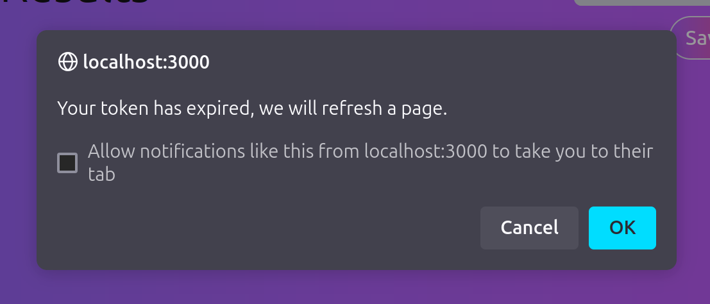
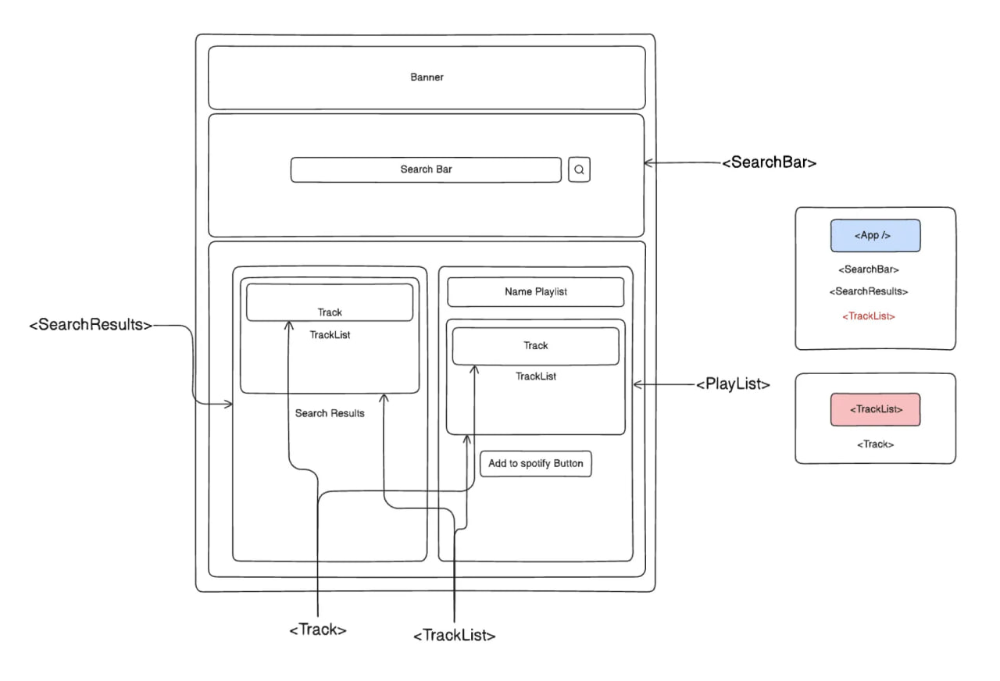

# Spotify Playlist Editor project

This is one of the personal projects I've done as part of the Codecademy Full-Stack Engineer course. Live version of the website is [here](https://jammmingprojectapp.netlify.app/); I am using this repo as practice ground for understanding git and Github as well.

## UI/UX

The expected usage of the website is as follows:
1. User authenticates their Spotify account, granting the app the ability to search tracks and modify Playlists
2. User searches for the songs (tracks) they wish to save
3. User selects whether they want to create a new playlist, or modify an existing one
4. After adding tracks to the playlist, user presses the Save button

UI is optimized, as much as possible, to streamline the user experience by automatically refreshing if the Spotify Access Token is expired and showing helpful success or error messages.

<p align="center">
    
</p>


https://github.com/user-attachments/assets/c28741ce-53c3-4b48-9ed1-c131e5e7872a


Future improvements:
* Add saving searched and playlist tracks on page refresh
* Re-render a select menu on saving new playlist
* Add an album pic

## Code architecture

The current structure is a result of several iterations and is inspired by the following resources:

1. [First React App -- Jamming](https://medium.com/@davies.matt.02/first-react-app-jamming-f98d9583e54c): a Medium article by Matthew Davies that includes very useful visualizations, such as:



2. [Step-by-step Youtube guide for functional components](https://www.youtube.com/watch?v=BeZUvaACVEA)
3. Hints and direction provided in the Codecademy lesson, including extra information for advanced feature requests (e.g. showing both new and existing playlists in the same UI, with an option to overwrite the existing one)

Having gone through these iterations, I have already encountered the problem of refactoring legacy code when trying to implement new features; but for me personally, that was one of the most fun parts of development, closer to the backend side of things.

I'm also using Tailwind CSS to practice with CSS frameworks!

## Spotify API

The Spotify for Developers reference provides most information needed to create an app like this. In particular, I used:
* Specific API endpoint pages to understand what data is passed and returned (e.g. [Create Playlist](https://developer.spotify.com/documentation/web-api/reference/create-playlist))
* [Authorization Code Flow](https://developer.spotify.com/documentation/web-api/tutorials/code-flow) to understand two approaches to creating, managing and using access tokens

The authorization in particular was one of the hardest parts to implement, particularly for such a frontend-only app, due to the access tokens expiring, being returned in a weird format, etc.

Due to the restrictions, it's not possible to use the deployed website without adding a particular user's Spotify token to the "[app](https://developer.spotify.com/documentation/web-api/tutorials/getting-started#create-an-app)" by myself. You will also need to create your personal token if trying to play around with the code locally:

screenshot of Spotify Authentication

## Running locally

To test the project on your local machine, you need to simply run:

```
npm install &&\
npm start
```

Open [http://localhost:3000](http://localhost:3000) to view the app in your browser.

The page will reload when any changes are made.
